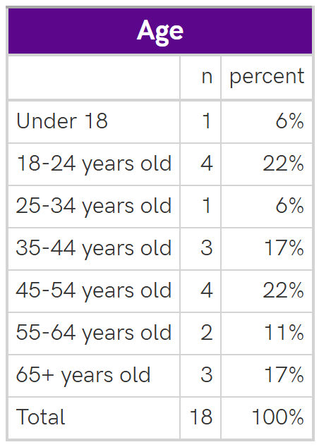
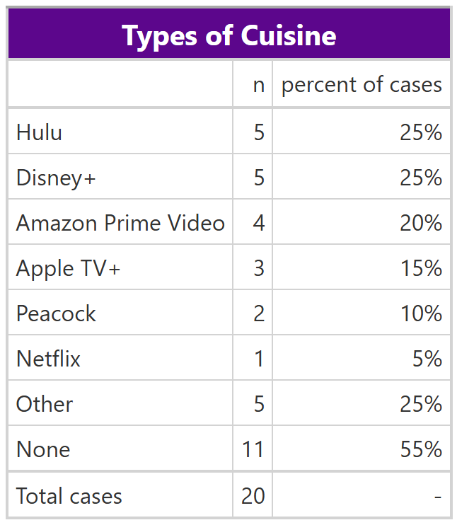
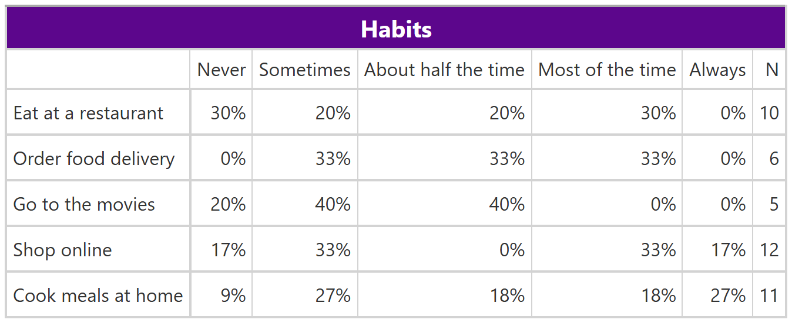
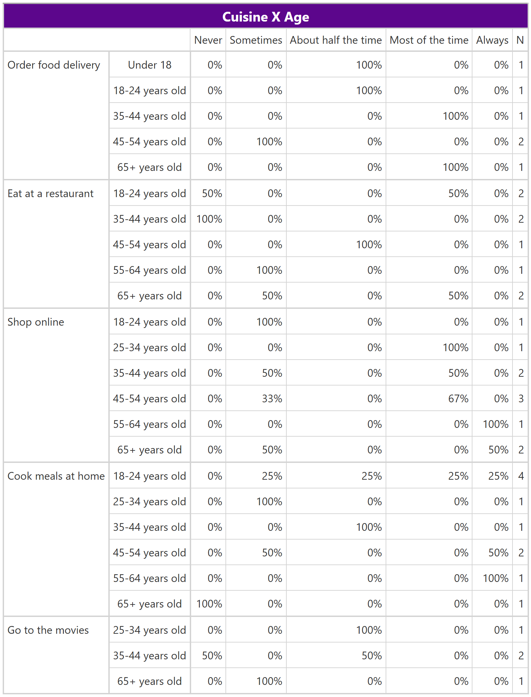

<!-- README.md is generated from README.Rmd. Please edit that file -->

# rchelperfunctions

<!-- badges: start -->

<!-- badges: end -->

The goal of rchelperfunctions is to provide reusable functions for
creating tables and some additional utility functions.

## Installation

You can install the development version of rchelperfunctions from
[GitHub](https://github.com/) with:

``` r
# install.packages("pak")
pak::pak("rosovconsulting/rchelperfunctions")
```

## Demonstration

``` r
library(rchelperfunctions)
library(janitor)
```

``` r
col_map <- create_column_map(rchabits)
```

``` r
age_table <- rchabits |> 
  tabyl(q1, show_na = FALSE) |> 
  adorn_totals() |>
  table_style("Age")
```



``` r
cuisine_table <- multi_response_table(rchabits, expss::mdset_p("q6_\\d")) |>
     multi_response_table_style("Types of Cuisine")
```



``` r
habits_table <- rchabits |>
    dplyr::select(tidyselect::starts_with("q3_")) |>
    likert_table() |>
    likert_table_style("Habits") |>
    gt::sub_missing(missing_text = "No answer")
```



``` r
cuisine_by_age_table <- rchabits |>
     dplyr::select(q1, tidyselect::starts_with("q3_")) |>
     likert_table(cross = q1) |>
     likert_table_style("Cuisine X Age")
```


